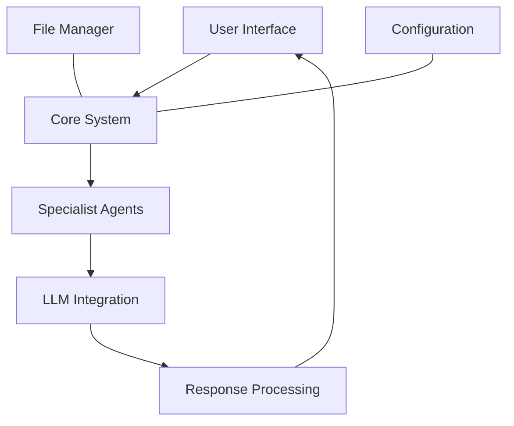

# 🏥 Medical AI Agent System


> A sophisticated AI-powered medical analysis system employing specialized agents to provide comprehensive healthcare assessments.


---

## ✨ Overview

This system leverages multiple AI agents, each specializing in different medical fields, to analyze patient reports and generate detailed medical assessments. By combining insights from various specialists, it delivers a comprehensive understanding of a patient's health status.

  

## 🌟 Key Features

<table>
  <tr>
    <td width="50%">
      <h3>🧠 Specialized Medical Agents</h3>
      <ul>
        <li>🫀 <b>Cardiologist:</b> Heart and cardiovascular health</li>
        <li>🧠 <b>Psychologist:</b> Mental health evaluation</li>
        <li>🫁 <b>Pulmonologist:</b> Respiratory system analysis</li>
        <li>➕ <b>Extensible:</b> Easily add new specialist agents</li>
      </ul>
    </td>
    <td width="50%">
      <h3>⚙️ System Features</h3>
      <ul>
        <li>🔄 <b>Multidisciplinary Analysis:</b> Combined specialist insights</li>
        <li>🖥️ <b>Interactive Interface:</b> User-friendly Streamlit UI</li>
        <li>🔒 <b>Secure API Integration:</b> Safe data handling</li>
        <li>📊 <b>Export Options:</b> Download results as JSON or text</li>
      </ul>
    </td>
  </tr>
</table>

## 🚀 Getting Started

### Prerequisites

- Python 3.8+
- Groq API key
- Required packages (listed in `requirements.txt`)

### Installation

1️⃣ **Clone the repository**
```bash
git clone https://github.com/yourusername/healthcare_agent.git
cd healthcare_agent
```

2️⃣ **Set up virtual environment**
```bash
python -m venv venv
source venv/bin/activate  # On Windows: venv\Scripts\activate
```

3️⃣ **Install dependencies**
```bash
pip install -r requirements.txt
```

4️⃣ **Configure environment**
Create a `.env` file with the following:
```
GROQ_API_KEY=your_api_key_here
GROQ_MODEL=meta-llama/llama-4-scout-17b-16e-instruct
LOG_LEVEL=INFO
MAX_WORKERS=3
```

### Launch Application

```bash
streamlit run app.py
```
Then visit: http://localhost:8501

## 💡 How to Use

<table>
  <tr>
    <td></td>
    <td>
      <h3>1️⃣ Configure API</h3>
      <p>Enter your Groq API key in the secure configuration section</p>
    </td>
  </tr>
  <tr>
    <td></td>
    <td>
      <h3>2️⃣ Select Report</h3>
      <p>Upload a medical report or choose from pre-loaded samples</p>
    </td>
  </tr>
  <tr>
    <td></td>
    <td>
      <h3>3️⃣ Choose Specialists</h3>
      <p>Select which medical specialists should analyze the report</p>
    </td>
  </tr>
  <tr>
    <td></td>
    <td>
      <h3>4️⃣ Analyze</h3>
      <p>Start the analysis and view real-time progress</p>
    </td>
  </tr>
  <tr>
    <td></td>
    <td>
      <h3>5️⃣ Review Results</h3>
      <p>View specialist reports and download results</p>
    </td>
  </tr>
</table>

## 🏗️ Technical Architecture

### Core Components



### Directory Structure
```
healthcare_agent/
├── agents/              # Specialist implementations
├── config/              # Configuration files
├── core/                # Core system components
├── data/                # Data storage
│   ├── results/         # Analysis results
│   └── sample_reports/  # Sample medical reports
├── services/            # Service implementations
├── templates/           # Prompt templates
├── utils/               # Utility functions
├── app.py               # Main application
├── requirements.txt     # Dependencies
└── README.md            # Documentation
```

## 🔧 Customization Guide

### Adding a New Specialist

1️⃣ **Create agent class**
```python
from core.agent_base import BaseAgent

class NewSpecialist(BaseAgent):
    def _get_role(self) -> str:
        return "NewSpecialist"
```

2️⃣ **Add prompt template**
```
Act like a [specialist]. You will receive a patient's report.

Task: [specific analysis task]
Focus: [specialized focus areas]
Recommendation: [recommendation format]

Patient's Report:
medical_report
```

3️⃣ **Register in agent factory**
Update `core/agent_factory.py` to include your new specialist.

## ⚠️ Disclaimer

> **Important:** This application is for demonstration purposes only and should not be used for actual medical diagnosis. Always consult qualified healthcare professionals for medical advice.

- Keep API keys secure and never share them
- Handle patient data according to relevant privacy regulations

## 📝 License

This project is licensed under the MIT License - see the [LICENSE](LICENSE) file for details.

## 🤝 Contributing

Contributions are welcome! Please feel free to submit a Pull Request.

## 📧 Contact

For questions or support, please open an issue in the repository.
